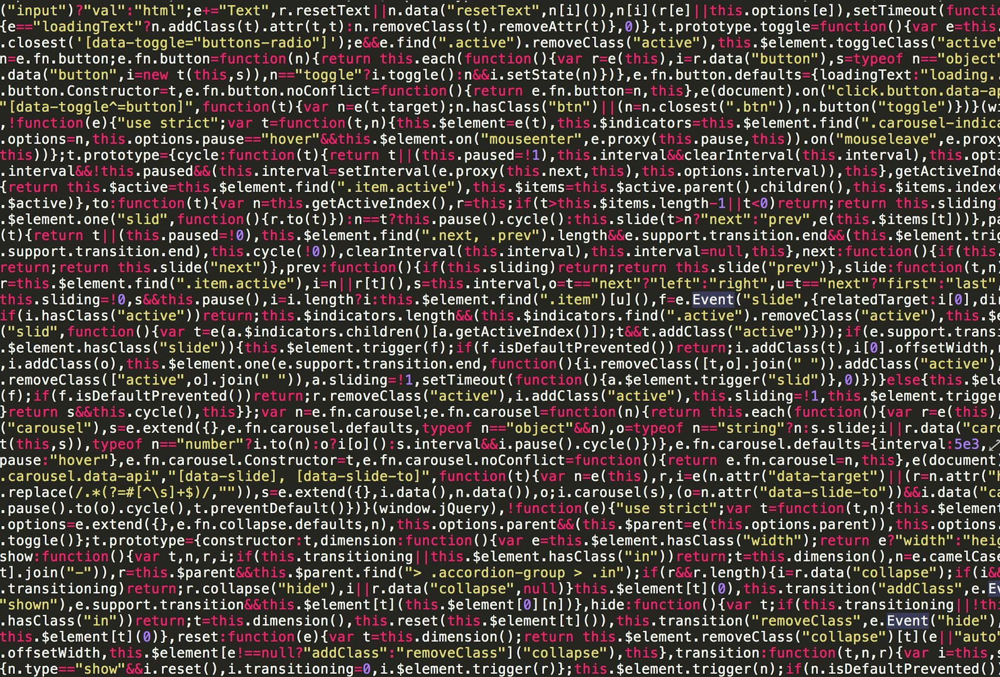

The last two years I have been making various little python scripts, learning a lot of things along the way, but now I feel like it's time to take my learning to a new level, and do things I always wanted to do

## What will I learn?

I have set my goals high, but I think it's possible. even if I don't finish, who cares? I will still have learnt a lot, and be a thousand steps ahead of where I am right now.

- Flask, Django, API Design, Database, Scaling

- Python - More libraries (Selenium, Tesseract, numpy, pandas, pygame, Manim.... the list goes on and on)

- HTML, CSS, JS, TS, Tailwind, React, Svelte, etc etc

- One or more programming languages

- Linux, Git, Docker, VMS, K8s, AWS, Firebase

- Networking(computers), Networking(people)

## My plan

That's a lotta stuff I chose to burden myself with. I plan to continue doing what I was already doing, and building tools to help automate tasks, and spend 3 days building something to save me 5 seconds a day.

I have already started building the [frontend](https://milktrack.netlify.app/) for my very first full stack web app, and I'm writing JS code without knowing a thing about js

With this one project, I hope to learn basic HTML, CSS, JS and some Flask for the backend. I hope to learn a lot of related skills like git, Databases, networking etc with this project, and provide me the footing to learn more.

## Why am I doing this?

idk i like programming v much next heading

## Thank you for reading

<figure>

<figcaption>

Photo by Sabrina Gelbart on [Pexels.com](https://www.pexels.com/photo/full-frame-shot-of-abstract-pattern-249798/)

</figcaption>

</figure>

## This guy made me do this, if my post sucks go blame it on him

well I'm not gonna make my own blog using next.js anytime soon, meanwhile have Wordpress instead :D
